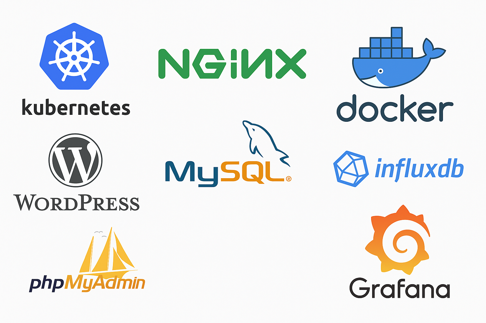

# ft_services

This project is about **clustering Docker applications** and deploying them with **Kubernetes**.  
It is part of the **42 Network School curriculum**, focusing on container orchestration, service management, and monitoring.

---

## 📦 Project Overview
The goal of **ft_services** is to set up a Kubernetes cluster that runs multiple containerized applications and services.  
Each service is deployed inside its own pod, managed by Kubernetes, and exposed through an Nginx ingress.  
This allows scaling, monitoring, and managing applications seamlessly.

---

## 🛠️ Technologies Used
The project leverages the following technologies:

- **Kubernetes** – Orchestration & cluster management  
- **Nginx** – Reverse proxy & load balancing  
- **Docker** – Containerization platform  
- **WordPress** – Blogging/CMS platform  
- **MySQL** – Relational database  
- **InfluxDB** – Time-series database  
- **phpMyAdmin** – Web interface for MySQL management  
- **Grafana** – Monitoring & visualization dashboards  

---

## 📊 Resources
The following stack of technologies is used in this project:

